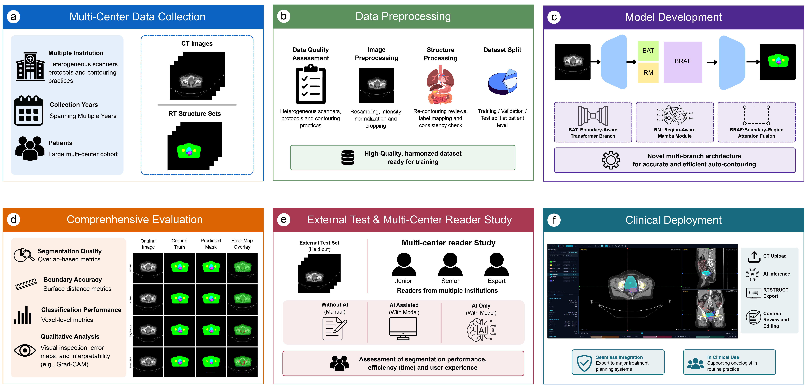
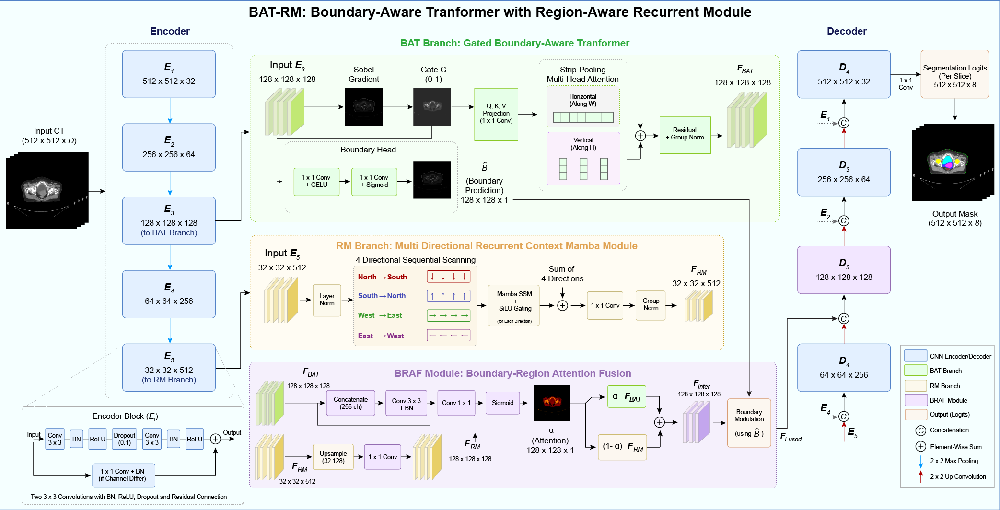
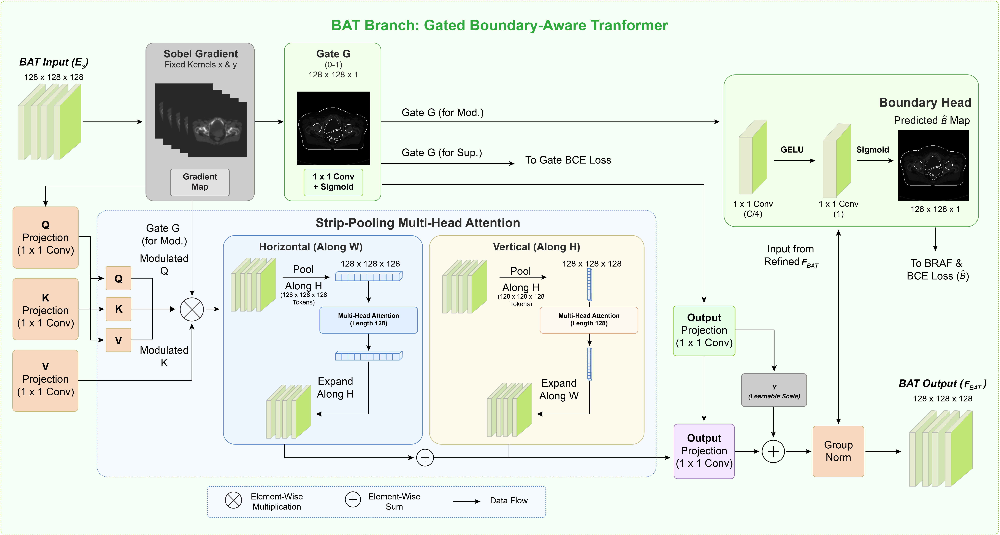
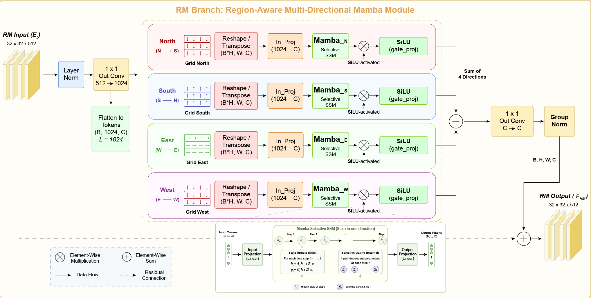

# BAT-RM: Boundary-Aware Transformer with Multi-Directional Recurrent Context Module for Clinically Deployed Cervical Cancer Radiotherapy Auto-Contouring

[](https://arxiv.org/abs/XXXX.XXXXX)
[](https://opensource.org/licenses/MIT)
[](https://www.python.org/downloads/)
[](https://pytorch.org/)

This repository contains the official implementation of **BAT-RM** for cervical cancer radiotherapy auto-contouring.

> **BAT-RM:  Boundary-Aware Transformer with Region-Aware Multi-Directional Mamba
for Clinically Deployed Cervical Cancer Radiotherapy Auto-Contouring**  
> *Istiak Ahmed, Galib Ahmed, Kazi Shahriar Sanjid, Md. Tanzim Hossain, Md. Anwarul Islam, Shahrukh Khan, Md. Ashrif Rahman Arian, Md. Nishan Khan, Md. Misbah Khan, S M Hasibul Hoque, Rahnuma Shahrin Rista, Md Arifur Rahman, Syed Md. Akram Hussain, Md. Mostafa Kamal Sarker, Mohammad Monir Uddin*  
> **Medical Image Analysis (Under Review)**  
> 📄 [Preprint](https://arxiv.org/abs/XXXX.XXXXX)

---

## 📌 Overview

Cervical cancer is the fourth leading cause of cancer death in women worldwide, with over 85% of cases occurring in low- and middle-income countries where oncologist shortages create radiotherapy planning backlogs of up to three days. BAT-RM is a **clinically deployed** end-to-end auto-contouring system for cervical cancer radiotherapy planning.

### Key Highlights

- ✅ **Clinically Deployed** — Production-grade web application with DICOM RTSTRUCT export
- ✅ **Multi-Centre Dataset** — 1,011 patients across 3 Bangladeshi tertiary-care hospitals
- ✅ **State-of-the-Art Performance** — GTV Dice: 0.966, HD95: 1.50 mm; CTV Dice: 0.957
- ✅ **Prospective Reader Study** — 13 oncologists, 100 cases, 80.7% time reduction
- ✅ **Efficient** — 3.8 GB VRAM, 18.3 ms/slice on NVIDIA T4 GPU

---

## 🏗️ Architecture

### Overall Pipeline

The end-to-end pipeline spans multi-centre data collection, preprocessing, BAT-RM model development, comprehensive evaluation, multi-centre reader study, and clinical deployment.

<p align="center">
  
</p>

### BAT-RM Architecture

The model integrates three complementary streams within a symmetric encoder-decoder backbone: a **Gated Boundary-Aware Transformer (BAT)** branch, a **Multi-Directional Mamba Module (RM)** branch, and a **Boundary-Region Attention Fusion (BRAF)** gate.

<p align="center">
  
</p>

### Gated Boundary-Aware Transformer (BAT) Branch

The BAT branch applies Sobel-derived gradient gating to restrict self-attention to organ boundary regions.

<p align="center">
  
</p>

### Multi-Directional Recurrent Context Module (RM Branch)

The RM branch performs four-directional sequential scanning using GRU-based recurrent modules to capture long-range spatial dependencies at linear complexity ($\mathcal{O}(N)$).

<p align="center">
  
</p>

---

## 📊 Dataset

| Feature | Details |
|---------|---------|
| **Total Patients** | 1,011 |
| **Institutions** | 3 (Bangladesh Medical University, Square Hospital Ltd., Labaid Hospital) |
| **Anatomical Classes** | 8 (Body, Bladder, Small Bowel, Rectum, Femoral Head, GTV, CTV, Background) |
| **Inter-Rater Reliability** | Mean pairwise Jaccard: $0.961 \pm 0.024$ ($n = 7$ annotators) |
| **Test Set** | 254 patient cases with complete annotations |

---

## 🧠 Model Performance

### Quantitative Results (Key Metrics)

| Structure | Dice | IoU | HD95 (mm) | ASD (mm) | NSD |
|-----------|------|-----|-----------|----------|-----|
| GTV | **0.9662** | **0.9348** | **1.500** | **0.564** | **0.978** |
| CTV | **0.9571** | **0.9184** | **1.507** | **0.512** | **0.973** |
| Rectum | **0.9556** | **0.9154** | **1.242** | **0.539** | **0.997** |
| Bladder | **0.9655** | **0.9335** | **1.366** | **0.588** | **0.988** |
| Small Bowel | **0.9741** | **0.9499** | **1.577** | **0.633** | **0.974** |

### Baseline Comparison

BAT-RM outperforms four baseline architectures (nnUNet, SegMamba, TransUNet, UNETR) across all seven anatomical classes with **medium-to-large effect sizes** (Hedges' $g$ up to 1.85, $p < 0.0001$).

### Reader Study Results

| Metric | Junior (Unaided) | Junior (AI-Assisted) | Improvement |
|--------|------------------|----------------------|-------------|
| Mean IoU | 0.899 | **0.965** | +0.066 |
| Contouring Time | 152 min | **29 min** | **80.7%** ↓ |
| Consultation Rate | 52.1% | **14.3%** | **72.6%** ↓ |
| Confidence Score | 0.590 | **0.828** | +0.238 |

---

## 💻 Computational Efficiency

| Model | Params (M) | GFLOPs | Inference (ms) | Peak VRAM (GB) | Training (hrs) |
|-------|------------|--------|----------------|----------------|----------------|
| **BAT-RM (Ours)** | **28.4** | **41.2** | **18.3** | **3.8** | **31.4** |
| nnUNet | 31.2 | 54.6 | 22.7 | 4.6 | 38.2 |
| SegMamba | 47.8 | 89.3 | 38.4 | 7.2 | 62.1 |
| TransUNet | 105.3 | 124.7 | 54.1 | 9.4 | 84.6 |
| UNETR | 92.6 | 108.4 | 46.8 | 8.1 | 71.3 |

---

## 🚀 Clinical Deployment

BAT-RM is deployed at Bangladesh Medical University through a **production-grade web application** with:

- 🖥️ Interactive contour editing (Varian Eclipse-inspired interface)
- 📤 Native DICOM RTSTRUCT export (compatible with Varian, RayStation, Monaco)
- ⚡ 18–22 seconds inference time for a typical CT study
- 📉 Patient wait time reduced from 1–3 days to 2–3 hours

<p align="center">
  
</p>

---

## 📁 Repository Structure

```
BAT-RM/
├── figures/
│   ├── Workflow.png
│   ├── Model_Architecture.png
│   ├── Model_Architecture_BAT.png
│   ├── Model_Architecture_RM.png
│   └── Webview_1.png
├── src/
│   ├── model.py
│   ├── train.py
│   ├── inference.py
│   └── utils.py
├── configs/
│   └── config.yaml
├── scripts/
│   ├── preprocess.py
│   └── evaluate.py
├── README.md
└── requirements.txt
```

---

## 🛠️ Requirements

```bash
# Core dependencies
- Python >= 3.9
- PyTorch >= 2.0.0
- torchvision >= 0.15.0
- numpy >= 1.21.0
- scipy >= 1.7.0
- SimpleITK >= 2.3.0
- pydicom >= 2.3.0
- matplotlib >= 3.5.0
- scikit-image >= 0.19.0
```

Install all dependencies:

```bash
pip install -r requirements.txt
```

---

## 🔧 Usage

### Training

```bash
python src/train.py --config configs/config.yaml
```

### Inference

```bash
python src/inference.py --input /path/to/dicom/ --output /path/to/rtstruct/
```

### Evaluation

```bash
python scripts/evaluate.py --pred /path/to/predictions/ --gt /path/to/ground_truth/
```

---

## 📝 Citation

If you use this work, please cite:

```bibtex
@article{ahmed2025batrm,
  title={BAT-RM: A Boundary-Aware Transformer with Multi-Directional Recurrent Context Module for Clinically Deployed Auto-Contouring in Cervical Cancer Radiotherapy},
  author={Ahmed, Istiak and Ahmed, Galib and Sanjid, Kazi Shahriar and Hossain, Md. Tanzim and Islam, Md. Anwarul and Khan, Shahrukh and Arian, Md. Ashrif Rahman and Khan, Md. Nishan and Khan, Md. Misbah and Hoque, S M Hasibul and Rista, Rahnuma Shahrin and Rahman, Md Arifur and Hussain, Syed Md. Akram and Sarker, Md. Mostafa Kamal and Uddin, Mohammad Monir},
  journal={Medical Image Analysis},
  year={2025},
  note={Under Review}
}
```

---

## 📄 License

This project is licensed under the MIT License — see the [LICENSE](LICENSE) file for details.

---

## 🤝 Contact

For questions, please contact:

- **Mohammad Monir Uddin** — monir.uddin@northsouth.edu
- **Istiak Ahmed** — istiak.ahmed1@northsouth.edu

---

## 🙏 Acknowledgements

This research was supported by an ICT-Special Grant from the Government of Bangladesh under the project titled ``AI-based Segmentation and Contouring for Radiotherapy: From Development to Clinical Deployment'' at North South University, and by North South University Research Grant CTRG-25-SEPS-45. The authors appreciate the clinical and technical contributions of Dr. A.T.M. Sazzad Hossain, Oncologist, National Institute of Cancer Research \& Hospital; Dr. Sharif Ahmed, Oncologist, United Hospital; Dr. Muhammad Masud Rana, Senior Medical Physicist, Bangabandhu Medical University; Prof. Dr. Sharmin Akhtar Rupa, Senior Consultant, Radiology \& Imaging, Bangladesh Specialized Hospital; Dr. Mahmud Hasan Mostofa Kamal, Department of Radiology and Imaging, Bangladesh Medical University; Dr. Ishtiaque Ahmed, Oncologist, Ahsania Mission Cancer \& General Hospital; and Md. Abdul Sabur, Senior Medical Physicist, Square Cancer Center, Square Hospitals Ltd., for their invaluable support in data collection, clinical validation, and domain expertise. We also thank the clinical teams of Bangladesh Medical University, Square Hospital Limited, Labaid Specialized Hospital, and United Hospital Limited for their collaboration and dedication to improving radio therapy planning in resource-constrained settings. 
